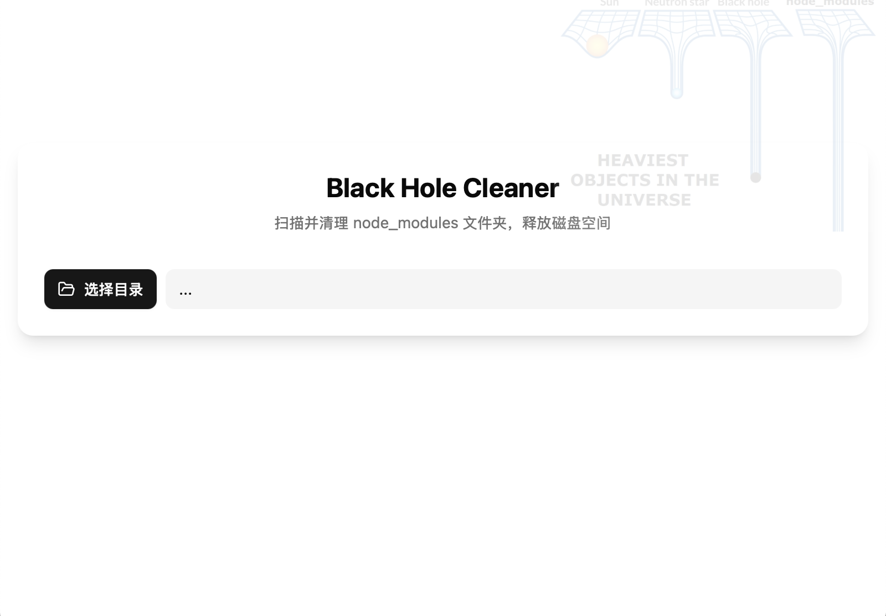

# Black Hole Cleaner

一款高效的 node_modules 清理工具，帮助您释放宝贵的磁盘空间。



## 功能特性

- 🔍 快速扫描：递归扫描目录中的所有 node_modules 文件夹
- 📊 空间分析：计算每个 node_modules 文件夹的大小（可选功能）
- 🗑️ 一键清理：选择并删除不需要的 node_modules 文件夹
- 🖥️ 跨平台：支持 Windows、macOS 和 Linux

## 技术栈

- **前端**：React + TypeScript + Vite
- **UI 组件**：自定义 UI 组件（基于 Radix UI）
- **样式**：TailwindCSS
- **桌面应用**：Tauri (Rust)

## 安装使用

### 开发环境

1. 安装依赖

```bash
pnpm install
```

3. 启动开发服务器

```bash
pnpm tauri dev
```

### 构建应用

```bash
pnpm tauri build
```

## 使用方法

1. 点击「选择目录」按钮，选择要扫描的目录
2. 勾选「计算文件大小」选项（可选，但会增加扫描时间）
3. 点击「扫描 node_modules」按钮开始扫描
4. 在列表中选择要删除的 node_modules 文件夹
5. 点击「清理选中的 node_modules」按钮执行清理
